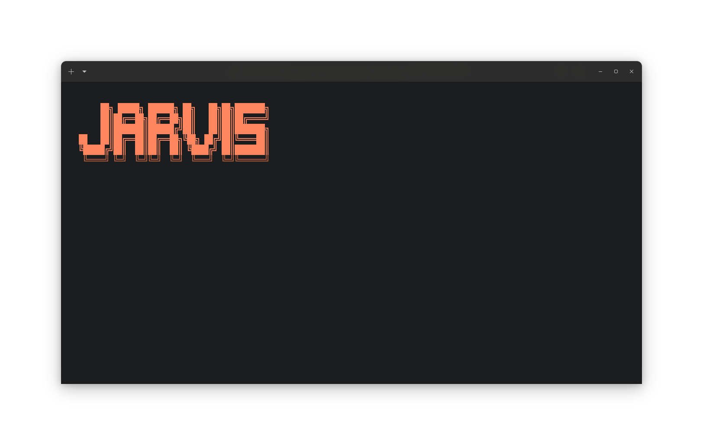

<p align="center">
  
</p>

<h1 align="center">Jarvis</h1>

<p align="center">
  <b>A personal system command for Linux workstations</b><br>
  <a href="#installation">Install</a> · <a href="#usage">Usage</a> · <a href="#commands">Commands</a>
</p>

<p align="center">
  
  
  
</p>

## Overview

**Jarvis** is a personal CLI utility that wraps common workstation tasks into a single, memorable command. It manages screen locks, RGB lighting, and log monitoring through a unified interface with colored terminal output and responsive ASCII banners.

Built as a learning project to understand how custom system commands are structured, installed, and distributed.

## Features

- **Screen Control** — Lock or unlock your GNOME session instantly or with a delay
- **RGB Lighting** — Toggle RAM LED colors via OpenRGB (`ffffff` / `000000`)
- **Log Monitor** — Live tail of personal logs with a clean banner refresh
- **Responsive UI** — Adapts banner width to terminal size
- **Zero Dependencies** — Pure Bash (installer uses `sudo` only for `/usr/local/bin`)

## Installation

### Prerequisites

- Linux with `bash` 4.0+
- `sudo` access (for installing to `/usr/local/bin`)
- Optional: `openrgb` for lighting control, GNOME for screen lock features

### Quick Install

```bash
sudo apt update && sudo apt install git curl -y \
git clone https://github.com/MdSakifHossain/jarvis-command \
cd jarvis-command \
chmod +x installer.sh \
./installer.sh install -y
```

### Manual Install

```bash
# Interactive mode — prompts for source path
./installer.sh install

# OR

# Direct mode — specify source
./installer.sh install command/jarvis
```

### Update

After editing `command/jarvis`, reinstall:

```bash
./installer.sh install -y
```

### Uninstall

```bash
# Interactive mode
./installer.sh uninstall

# OR

# Direct mode
./installer.sh uninstall -y
```

## Usage

```bash
jarvis [command] [options]
```

### Global Flags

| Flag            | Description           |
| --------------- | --------------------- |
| `-v, --version` | Show version and exit |
| `-h, --help`    | Show help and exit    |

### Commands

| Command   | Description                      | Example            |
| --------- | -------------------------------- | ------------------ |
| `lights`  | Control RGB RAM lighting         | `jarvis lights on` |
| `lock`    | Lock screen (optionally delayed) | `jarvis lock 5`    |
| `unlock`  | Unlock GNOME session             | `jarvis unlock`    |
| `observe` | Monitor vault logs live          | `jarvis observe`   |
| `monitor` | Alias for `observe`              | `jarvis monitor`   |

## Project Structure

```bash
jarvis-command/
├── command/           # Source script(s) for installation
│   └── jarvis         # The main command (installed to /usr/local/bin)
├── Banner.png         # Banner for README
├── installer.sh       # Unified install/uninstall tool
├── README.md
└── todo.md
```

## Important Notes

- The installer writes to `/usr/local/bin` and requires `sudo`
- The `command/` directory should contain **one file** for predictable behavior
- Test locally before installing: `./command/jarvis --help`

## Compatibility

- **OS:** Linux distributions
- **Shell:** `bash`, `zsh`
- **Desktop:** GNOME (for screen lock/unlock features)

## License

MIT — do whatever you want, no warranty.
